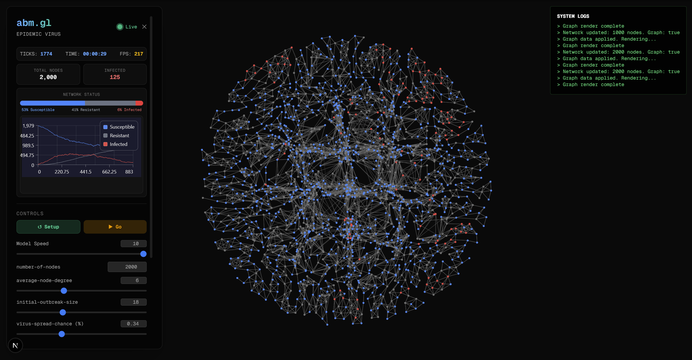

# abm.gl Network Sandbox

This repository is a dedicated sandbox for network-based agent experimentation within the broader `abm.gl` ecosystem. It leverages GPU-accelerated computing to simulate epidemiological virus dynamics across a force-directed graph architecture.

## Overview

Unlike the primary `abm.gl` framework which focuses on massive-scale spatial ABMs using Three.js WebGPU compute shaders, this sandbox is specifically tuned for **Network Theory** and **Graph-Based Simulations**. 

### The Model: Virus on a Network

This sandbox implements a high-performance GPU-accelerated version of the classic [NetLogo "Virus on a Network" model](https://ccl.northwestern.edu/netlogo/models/VirusonaNetwork). 



This model demonstrates the spread of a virus through a network (e.g. modeling the progress of a computer virus/worm). Each node represents an entity (like a computer) and can be in one of three states:
- **Susceptible (Blue)**: Healthy but vulnerable.
- **Infected (Red)**: Currently carrying and spreading the virus.
- **Resistant (Gray)**: Immune to the virus (e.g. patched with antivirus).

**How it works:**
Each tick, infected nodes attempt to infect all their neighbors. Susceptible neighbors will be infected based on the `virus-spread-chance`. Infected nodes periodically check if they are infected based on `virus-check-frequency`. If detected, they have a `recovery-chance` to be healed. Recovered nodes then have a `gain-resistance-chance` to become permanently resistant.

### Key Technologies
- **Rendering**: `@cosmos.gl/graph` for ultra-fast 2D WebGL graph rendering.
- **Physics Engine**: Custom WebGPU compute shaders (`VirusDynamics.ts`) that calculate network forces, bounding collisions, and infection state transitions directly on the GPU.
- **Telemetry**: `@chartgpu/chartgpu` and `chartgpu-react` for blazing-fast 60FPS streaming telemetry (tracking Susceptible, Infected, and Resistant populations).
- **State Management**: `zustand` for high-performance reactive UI state without triggering massive React re-renders.
- **UI Framework**: Next.js App Router and TailwindCSS for a sleek, glass-morphism dashboard.

## Simulation Features
- **GPU-Accelerated SIR Model**: Simulates Susceptible, Infected, and Resistant states.
- **Force-Directed Graph**: Nodes repel each other while links act as springs.
- **Real-Time HUD**: Tracks ticks, exact simulation time (HH:MM:SS), and browser FPS.
- **Dynamic Controls**: Instantly tweak parameters like Infection Radius, Recovery Probability, Force Strength, and Friction.

## Setup & Running
```bash
cd frontend
npm install
npm run dev
```
Open [http://localhost:3000](http://localhost:3000) to view the simulation.

## Architecture Highlights
- **No-React-Render Telemetry**: The graph and charts are driven entirely by custom DOM manipulation (`useRef` and `innerText`) and `setOption` commands, bypassing React's standard render cycle to maintain a flawless 60 FPS under heavy load.
- **Custom StrictMode Bypasses**: The telemetry chart utilizes manual buffer management and array truncation to completely sidestep React 18 Strict Mode double-mounting memory leaks.
